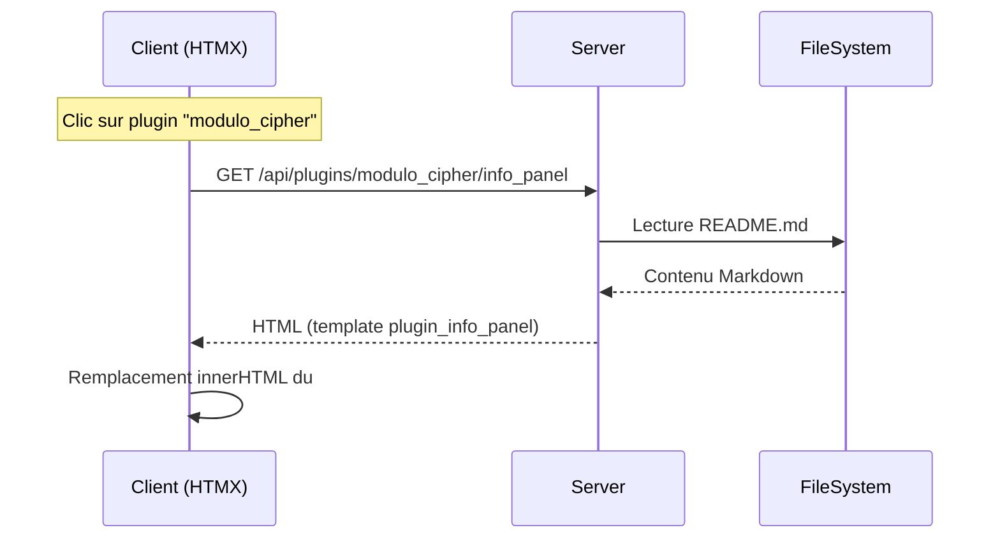

# Panneau d'Informations

> Dernière mise à jour : {{ "now" | date("%d/%m/%Y") }}

Ce document décrit la mise en place et le fonctionnement du **panneau d'Informations** dans MysteryAI.

## 1. Objectif

Offrir une zone latérale (panneau inférieur) capable d'afficher dynamiquement :

1. Un contenu générique par défaut (aide, changelog, etc.)
2. La documentation _README.md_ d'un plugin lorsqu'un onglet correspondant est actif ou lorsqu'on clique sur le plugin dans la liste.

Le comportement est comparable aux panneaux **Notes** et **Logs**, mais appliqué aux informations techniques.

## 2. Architecture

```
+-----------------+------------------------+
|   UI (HTMX)     |  Backend (Flask)       |
+-----------------+------------------------+
| index.html      |  Blueprint main        |
|  ↳ div#informations-panel (htmx)         |
| plugins_list.html (htmx link)            |
| layout_initialize.js (updateInformation) |
+------------------------------------------+
```

### 2.1. Routes

| Méthode | URL | Description | Renvoie |
|---------|-----|-------------|---------|
| GET | `/api/informations_panel` | Contenu générique du panneau | Template `informations_panel.html` |
| GET | `/api/plugins/<plugin_name>/info_panel` | README d'un plugin | Template `plugin_info_panel.html` |

Les routes se trouvent dans :

* `app/routes/main.py` → `informations_panel()`
* `app/routes/plugins.py` → `get_plugin_info_panel()`

### 2.2. Templates

* **`templates/informations_panel.html`** : squelette par défaut.
* **`templates/plugin_info_panel.html`** : affiche le HTML rendu du README d'un plugin.

### 2.3. Front-end (JS)

Ajout dans `static/js/layout_initialize.js` :

```javascript
function updateInformationPanel(contentItem) {
  if (contentItem.componentName === 'plugin' && state.pluginName) {
     // Charge README
     htmx.ajax('GET', `/api/plugins/${encodeURIComponent(state.pluginName)}/info_panel`, {...});
  } else {
     // Contenu générique
     htmx.ajax('GET', '/api/informations_panel', {...});
  }
}
```

La fonction est appelée :

* sur `activeContentItemChanged` de `mainLayout`,
* sur chaque `stack` nouvellement créée,
* lors des clics sur les onglets.

### 2.4. Conversion Markdown → HTML

```python
readme_html = markdown.markdown(readme_content, extensions=['fenced_code', 'tables'])
```

Si le paquet `markdown` n'est pas installé, le texte brut est encapsulé dans `<pre>`.

## 3. Flux de données



## 4. Personnalisation

* **Styles** : le contenu est encapsulé dans `prose prose-invert`, compatible avec [Tailwind Typography](https://tailwindcss.com/docs/typography-plugin).
* **Extensions Markdown** : `fenced_code`, `tables` peuvent être complétées par `codehilite`, etc.

## 5. Dépendances

```text
Flask
markdown>=3.0  # rendu Markdown -> HTML
HTMX            # chargement dynamique côté client
```

## 6. Améliorations futures

1. Ajout du surlignage syntaxique des blocs de code (`pygments`).
2. Mise en cache (Redis ou simple LRU) du rendu HTML des README pour réduire les I/O.
3. Prise en charge de fichiers `CHANGELOG.md`, `FAQ.md` si présents.
4. Ajout d'un bouton "Ouvrir dans un nouvel onglet" vers la doc complète du plugin. 