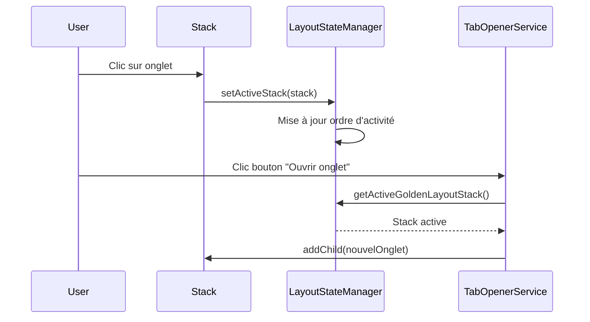

# Système de Suivi des Stacks et Components Actifs

## Vue d'ensemble

Ce document décrit le système amélioré de suivi des stacks et components actifs dans GoldenLayout, qui permet d'ouvrir les nouveaux onglets dans la section réellement active plutôt que dans la première section disponible.

## Problème Résolu

**Avant** : Quand le paramètre `open_tab_in_same_section` était activé, les nouveaux onglets s'ouvraient toujours dans la première section de l'application, pas dans la section active.

**Après** : Les nouveaux onglets s'ouvrent maintenant dans la section où l'utilisateur travaille actuellement.

## Architecture

### 1. LayoutStateManager Amélioré

Le `LayoutStateManager` a été enrichi pour suivre précisément l'activité des stacks :

```javascript
class LayoutStateManager {
    constructor() {
        this.activeStack = null;              // Stack actuellement active
        this.lastActiveStack = null;          // Dernière stack active
        this.stackActivityOrder = [];         // Historique d'activité des stacks
        this.stacks = new Map();             // Toutes les stacks avec métadonnées
        this.components = new Map();         // Tous les components avec métadonnées
    }
}
```

### 2. Suivi de l'Activité

Le système écoute plusieurs événements GoldenLayout pour détecter l'activité :

#### Événements Écoutés
- `stackCreated` : Nouvelle stack créée
- `activeContentItemChanged` : Changement d'onglet actif
- `focus` : Changement de focus global
- Clics sur les onglets : Détection directe de l'interaction utilisateur

#### Flux de Détection


### 3. Méthodes de Récupération des Stacks

#### `getActiveGoldenLayoutStack()`
Retourne la stack actuellement active (celle où l'utilisateur a cliqué en dernier).

#### `getMostRecentActiveStack()`
Retourne la stack la plus récemment active si aucune n'est actuellement active.

#### `getStacksByActivity()`
Retourne toutes les stacks triées par ordre d'activité récente.

## Intégration avec TabOpenerService

### Nouvelle Logique d'Ouverture

```javascript
addToExistingSection(componentConfig) {
    // 1. Essayer la stack active
    const activeStack = this.findActiveStack();
    if (activeStack) {
        activeStack.addChild(componentConfig);
        return;
    }
    
    // 2. Fallback: stack existante
    const fallbackStack = this.findBestStack();
    if (fallbackStack) {
        fallbackStack.addChild(componentConfig);
        return;
    }
    
    // 3. Dernier recours: section principale
    window.mainLayout.root.contentItems[0].addChild(componentConfig);
}
```

### Méthode `findActiveStack()`

```javascript
findActiveStack() {
    if (!window.layoutStateManager) return null;
    
    // Priorité 1: Stack actuellement active
    const activeStack = window.layoutStateManager.getActiveGoldenLayoutStack();
    if (activeStack) return activeStack;
    
    // Priorité 2: Stack récemment active
    const recentStack = window.layoutStateManager.getMostRecentActiveStack();
    if (recentStack) return recentStack;
    
    return null;
}
```

## Logging et Debug

### Messages de Debug

Le système produit des logs détaillés pour faciliter le debugging :

```
=== LayoutStateManager: Configuration des écouteurs GoldenLayout ===
=== LayoutStateManager: Enregistrement stack === {id: "stack1", components: ["comp1"]}
=== LayoutStateManager: Mise à jour stack active === {stackId: "stack2", previousActive: "stack1"}
🎯 TabOpener: Stack active trouvée: stack2
🎯 TabOpener: Ajout à la stack active: stack2
✅ TabOpener: Onglet ajouté à la stack active
```

### Méthode de Debug

```javascript
// Afficher l'état actuel du gestionnaire
window.layoutStateManager.debugState();
```

## Ordre de Priorité pour l'Ouverture d'Onglets

Quand `open_tab_in_same_section = true` :

1. **Stack Active** : La stack où l'utilisateur a cliqué en dernier
2. **Stack Récemment Active** : La stack la plus récemment active
3. **Stack par Activité** : Stacks triées par ordre d'activité
4. **Stack avec Plus d'Onglets** : Ancienne méthode (fallback)
5. **Section Principale** : Dernier recours

## Avantages du Nouveau Système

### 1. Précision
- Les onglets s'ouvrent exactement où l'utilisateur travaille
- Respect de l'intention utilisateur

### 2. Intuitivité
- Comportement prévisible et logique
- Moins de confusion pour l'utilisateur

### 3. Performance
- Suivi en temps réel sans polling
- Cache intelligent des références GoldenLayout

### 4. Robustesse
- Système de fallback en cas d'échec
- Gestion des cas d'erreur

### 5. Maintenabilité
- Code centralisé dans le LayoutStateManager
- API claire et documentée

## Cas d'Usage

### Scénario 1 : Utilisateur avec Plusieurs Sections
```
Section A: [Géocache 1] [Géocache 2] <- Active
Section B: [Carte] [Solver]

Action: Clic sur "Ouvrir Multi-Solver"
Résultat: Multi-Solver s'ouvre dans Section A
```

### Scénario 2 : Changement de Section
```
Section A: [Géocache 1] [Géocache 2]
Section B: [Carte] [Solver] <- Active (utilisateur a cliqué)

Action: Clic sur "Ouvrir Formula Solver"
Résultat: Formula Solver s'ouvre dans Section B
```

### Scénario 3 : Nouvelle Session
```
Section A: [Bienvenue] <- Seule section

Action: Clic sur "Ouvrir Carte"
Résultat: Carte s'ouvre dans Section A (comportement normal)
```

## Migration et Compatibilité

### Rétrocompatibilité
- L'ancien système continue de fonctionner si le LayoutStateManager n'est pas disponible
- Pas de rupture dans le code existant
- Fallback automatique vers l'ancienne méthode

### Tests de Validation
1. Vérifier que les onglets s'ouvrent dans la section active
2. Tester le changement de section active
3. Valider le comportement avec une seule section
4. Confirmer le fallback en cas d'erreur

## Configuration

Aucune configuration supplémentaire n'est requise. Le système s'active automatiquement quand :
- `LayoutStateManager` est chargé
- `TabOpenerService` est chargé
- GoldenLayout est initialisé

## Dépannage

### Problème : Les onglets ne s'ouvrent pas dans la bonne section

**Vérifications** :
1. Le `LayoutStateManager` est-il chargé ?
2. Les événements GoldenLayout sont-ils écoutés ?
3. Y a-t-il des erreurs dans la console ?

**Debug** :
```javascript
// Vérifier l'état du gestionnaire
window.layoutStateManager.debugState();

// Vérifier la stack active
console.log(window.layoutStateManager.getActiveGoldenLayoutStack());
```

### Problème : Erreurs JavaScript

**Causes courantes** :
- `LayoutStateManager` non initialisé
- Événements GoldenLayout non configurés
- Références invalides vers les stacks

**Solution** :
Vérifier l'ordre de chargement des scripts et l'initialisation de GoldenLayout.

---

*Ce système améliore significativement l'expérience utilisateur en respectant l'intention de l'utilisateur lors de l'ouverture de nouveaux onglets.* 