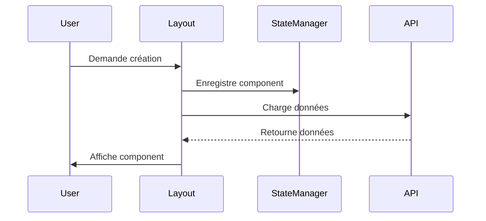
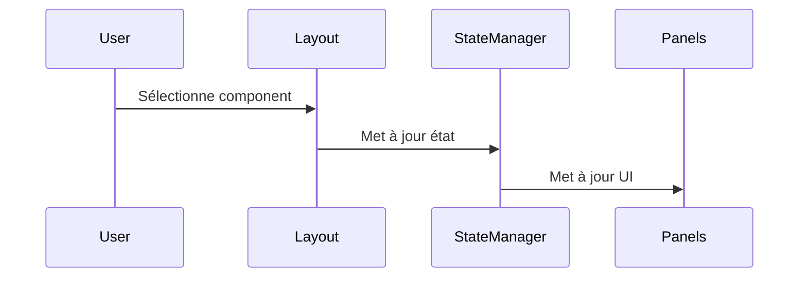

# Système de Layout MysteryAI

## Vue d'ensemble

Le système de layout de MysteryAI est construit autour de trois composants principaux :
1. GoldenLayout pour la gestion des onglets et composants
2. Un gestionnaire d'état personnalisé pour suivre l'état du layout
3. Un système de panneaux (panels) pour l'interface utilisateur

## Architecture

```
+------------------+-------------------+------------------+
|                 |                   |                  |
| Barre latérale  |  Zone principale  | Barre latérale  |
|    gauche       |   GoldenLayout    |    droite       |
|    (48px)       |                   |    (48px)       |
|                 |                   |                  |
+--------+--------+-------------------+--------+--------+
|        |                                    |        |
| Panel  |                                    | Panel  |
| gauche |                                    | droit  |
|(250px) |                                    |(250px) |
|        |                                    |        |
+--------+------------------------------------+--------+
|                 Panel inférieur                      |
|                 (35px - 800px)                       |
+--------------------------------------------------+
```

## Composants Principaux

### 1. Gestionnaire d'État (LayoutStateManager)

Le gestionnaire d'état est responsable du suivi de l'état global du layout.

**Fichier**: `static/js/layout_state_manager.js`

**Fonctionnalités principales**:
- Suivi des stacks et components actifs
- Enregistrement des métadonnées des components
- Gestion des relations entre stacks et components

**API**:
```javascript
// Obtenir les infos sur le component actif
const activeComponent = window.layoutStateManager.getActiveComponentInfo();

// Obtenir tous les components d'un type
const geocaches = window.layoutStateManager.getComponentsByType('geocache');

// Obtenir les infos sur le stack actif
const activeStack = window.layoutStateManager.getActiveStackInfo();
```

### 2. Système de Panneaux (Panels)

**Fichier**: `static/js/panels.js`

**Fonctionnalités**:
- Gestion des panneaux latéraux (gauche/droite)
- Panel inférieur avec système d'onglets
- Redimensionnement dynamique
- Chargement de contenu asynchrone

**États des panneaux**:
- Visible/Caché
- Taille (largeur/hauteur)
- Contenu actif
- Position

### 3. Initialisation du Layout

**Fichier**: `static/js/layout_initialize.js`

**Responsabilités**:
- Configuration initiale de GoldenLayout
- Enregistrement des composants
- Gestion des événements layout
- Intégration avec le gestionnaire d'état

## Types de Composants

### 1. Composant Welcome
- Page d'accueil par défaut
- Affiche les informations de bienvenue

### 2. Composant Alphabets
- Affiche la liste des alphabets disponibles
- Chargement asynchrone depuis l'API

### 3. Composant Alphabet Viewer
- Affiche un alphabet spécifique
- Intégration avec Stimulus.js

### 4. Composant Image Editor
- Éditeur d'images intégré
- Utilise Fabric.js pour l'édition
- Communication IPC avec Electron

## Flux de Communication

### 1. Création d'un Nouveau Component


### 2. Changement de Component Actif


## Gestion des Événements

### 1. Événements Layout
- `itemCreated`: Création d'un nouvel élément
- `stackCreated`: Création d'un nouveau stack
- `activeContentItemChanged`: Changement de component actif

### 2. Événements Panels
- Redimensionnement
- Ouverture/Fermeture
- Changement d'onglet

## Bonnes Pratiques

### 1. Gestion d'État
- Toujours utiliser le LayoutStateManager pour les modifications d'état
- Éviter les modifications directes de l'état
- Logger les changements importants

### 2. Performance
- Utiliser la délégation d'événements
- Limiter les requêtes API
- Optimiser les redimensionnements

### 3. Maintenance
- Suivre les conventions de nommage
- Documenter les changements majeurs
- Utiliser les outils de debugging

## Debugging

### 1. Logs Console
```javascript
// Logs de création de component
=== Layout: Component créé === {id: "comp1", type: "geocache"}

// Logs de changement d'état
=== LayoutStateManager: Mise à jour component actif === {id: "comp1"}

// Logs d'erreur
=== Panels: Erreur - Éléments DOM manquants ===
```

### 2. Outils de Développement
- Console Chrome pour les logs
- Devtools Electron
- React Developer Tools (si applicable)

## Configuration

### 1. GoldenLayout
```javascript
const config = {
    settings: {
        showPopoutIcon: false,
        showMaximiseIcon: false,
        showCloseIcon: false
    },
    content: [{
        type: 'row',
        content: [{
            type: 'component',
            componentName: 'welcome',
            title: 'Bienvenue'
        }]
    }]
};
```

### 2. Panels
```javascript
// Configuration par défaut des panels
const defaultPanelConfig = {
    minWidth: 100,
    maxWidth: 800,
    defaultWidth: 250
};
```

## Extensibilité

### 1. Ajout d'un Nouveau Component
1. Enregistrer le component dans layout_initialize.js
2. Créer les gestionnaires d'état nécessaires
3. Implémenter le rendu et la logique
4. Documenter le nouveau component

### 2. Modification des Panels
1. Mettre à jour la configuration des panels
2. Adapter les gestionnaires d'événements
3. Mettre à jour la documentation

## Dépendances

### 1. Externes
- GoldenLayout
- jQuery
- Fabric.js
- HTMX

### 2. Internes
- layout_state_manager.js
- panels.js
- layout_initialize.js

## Sécurité

### 1. IPC
- Utilisation du context bridge
- Validation des données
- Gestion des erreurs

### 2. API
- Validation des entrées
- Gestion des sessions
- Protection CSRF

## Prochaines Étapes

### 1. Améliorations
- [ ] Optimisation des performances
- [ ] Amélioration de la gestion des erreurs
- [ ] Tests unitaires

### 2. Nouvelles Fonctionnalités
- [ ] Système de persistance
- [ ] Drag and drop entre components
- [ ] Thèmes personnalisés
