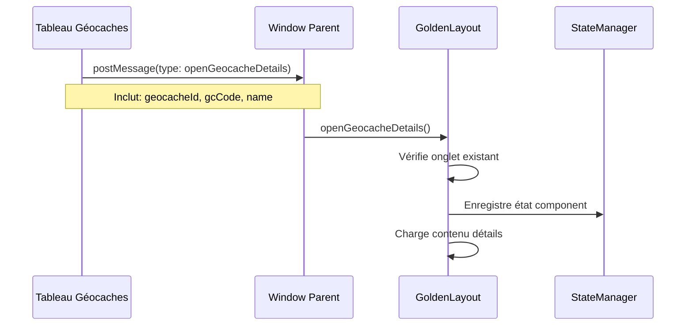
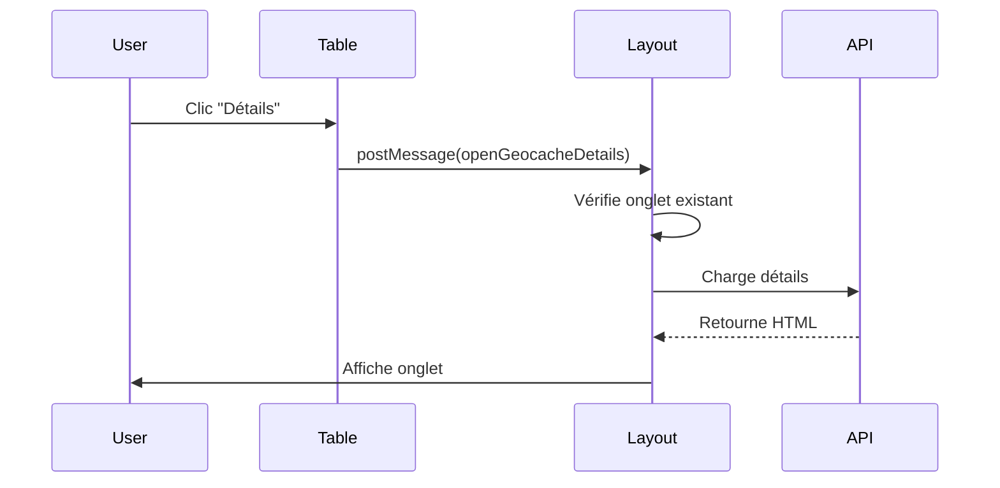
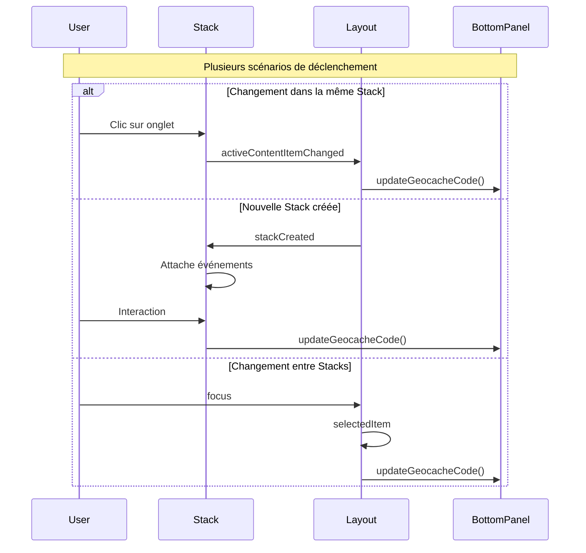

# Système de Layout MysteryAI

## Vue d'ensemble

Le système de layout de MysteryAI est construit autour de trois composants principaux :
1. GoldenLayout pour la gestion des onglets et composants
2. Un gestionnaire d'état personnalisé pour suivre l'état du layout
3. Un système de panneaux (panels) pour l'interface utilisateur

## Architecture

```
+------------------+-------------------+------------------+
|                 |                   |                  |
| Barre latérale  |  Zone principale  | Barre latérale  |
|    gauche       |   GoldenLayout    |    droite       |
|    (48px)       |                   |    (48px)       |
|                 |                   |                  |
+--------+--------+-------------------+--------+--------+
|        |                                    |        |
| Panel  |                                    | Panel  |
| gauche |                                    | droit  |
|(250px) |                                    |(250px) |
|        |                                    |        |
+--------+------------------------------------+--------+
|                 Panel inférieur                      |
|                 (35px - 800px)                       |
+--------------------------------------------------+
```

## Composants Principaux

### 1. Gestionnaire d'État (LayoutStateManager)

Le gestionnaire d'état est responsable du suivi de l'état global du layout.

**Fichier**: `static/js/layout_state_manager.js`

**Fonctionnalités principales**:
- Suivi des stacks et components actifs
- Enregistrement des métadonnées des components
- Gestion des relations entre stacks et components

### 2. Composant Géocache Details

**Fichier**: `static/js/layout_initialize.js`

**Fonctionnalités**:
- Affichage des détails d'une géocache dans un nouvel onglet
- Gestion des métadonnées (GC code, nom, ID)
- Chargement asynchrone du contenu
- Réutilisation des onglets existants

**Flux de données**:


**Communication**:
1. Le tableau des géocaches envoie un message avec :
   ```javascript
   {
       type: 'openGeocacheDetails',
       geocacheId: id,
       gcCode: 'GC12345',
       name: 'Nom Cache'
   }
   ```

2. La fonction `openGeocacheDetails` :
   ```javascript
   window.openGeocacheDetails(geocacheId, gcCode, name)
   ```
   - Crée un ID unique : `geocache-details-${geocacheId}`
   - Vérifie si l'onglet existe déjà
   - Configure le component avec les métadonnées

3. Le composant géocache-details :
   - Initialise l'état avec les métadonnées
   - Met à jour le titre de l'onglet
   - Charge le contenu HTML
   - Gère les erreurs de chargement

### 3. Système de Panneaux (Panels)

**Fichier**: `static/js/panels.js`

**Fonctionnalités**:
- Gestion des panneaux latéraux (gauche/droite)
- Panel inférieur avec système d'onglets
- Redimensionnement dynamique
- Chargement de contenu asynchrone

### 4. Initialisation du Layout

**Fichier**: `static/js/layout_initialize.js`

**Responsabilités**:
- Configuration initiale de GoldenLayout
- Enregistrement des composants
- Gestion des événements layout
- Intégration avec le gestionnaire d'état

## Types de Composants

### 1. Composant Welcome
- Page d'accueil par défaut
- Affiche les informations de bienvenue

### 2. Composant Géocaches Table
- Affiche la liste des géocaches
- Intégration avec Tabulator
- Actions : Détails, Suppression
- Communication avec le parent via postMessage

### 3. Composant Géocache Details
- Affiche les détails d'une géocache spécifique
- Gestion des métadonnées
- Interface de modification
- Sauvegarde des changements

### 4. Composant Image Editor
- Éditeur d'images intégré
- Utilise Fabric.js pour l'édition
- Communication IPC avec Electron

## Flux de Communication

### 1. Ouverture des Détails d'une Géocache


## Gestion des Événements

### 1. Événements Layout
- `itemCreated`: Création d'un nouvel élément
- `stackCreated`: Création d'un nouveau stack
- `activeContentItemChanged`: Changement de component actif
- `focus`: Changement de focus global

### 2. Événements Composants
- Ouverture des détails de géocache
- Sauvegarde des modifications
- Gestion des erreurs
- Mise à jour du code GC dans le panneau inférieur

### 3. Flux d'Événements pour le Code GC


### 4. Gestion des Métadonnées
```javascript
// Exemple de mise à jour du code GC
function updateGeocacheCode(contentItem) {
    if (contentItem?.config?.componentState?.gcCode) {
        document.querySelector('.geocache-code').textContent = 
            contentItem.config.componentState.gcCode;
    }
}
```

### 5. Points de Déclenchement
- Création d'une nouvelle stack
- Changement d'onglet dans une stack
- Focus sur une stack différente
- Clic direct sur un onglet
- Création d'un nouveau composant

## Interface Utilisateur

### 1. Panneau Inférieur
- Barre d'onglets avec Map, Notes, Informations
- Affichage du code GC à droite
- Style monospace pour le code GC
- Fond sombre et coins arrondis

### 2. Styles CSS
```css
.bottom-panel-header {
    display: flex;
    justify-content: space-between;
    align-items: center;
}

.geocache-code {
    font-family: monospace;
    background-color: rgb(17, 24, 39);
    border-radius: 0.25rem;
}
```

### 3. Structure HTML
```html
<div class="bottom-panel-header">
    <div class="bottom-panel-tabs">
        <!-- Onglets: Map, Notes, Informations -->
    </div>
    <div class="geocache-code">
        <!-- Code GC dynamique -->
    </div>
</div>
```

## Bonnes Pratiques

### 1. Gestion d'État
- Toujours utiliser le LayoutStateManager pour les modifications d'état
- Éviter les modifications directes de l'état
- Logger les changements importants

### 2. Communication
- Utiliser postMessage pour la communication iframe/parent
- Passer toutes les métadonnées nécessaires
- Gérer les erreurs de communication

### 3. Performance
- Réutiliser les onglets existants
- Charger le contenu de manière asynchrone
- Optimiser les mises à jour d'état

## Debugging

### 1. Logs Console
```javascript
// Ouverture des détails
=== Layout: Component actif changé === {
    id: "geocache-details-123",
    type: "geocache-details",
    state: {
        geocacheId: 123,
        gcCode: "GC12345",
        name: "Nom Cache"
    }
}
```

### 2. Gestion des Erreurs
```javascript
// Erreur de chargement
=== DEBUG: Erreur lors du chargement des détails ===
Error: HTTP error! status: 404
```

## Prochaines Étapes

### 1. Améliorations
- [ ] Optimisation des performances de chargement
- [ ] Amélioration de la gestion des erreurs
- [ ] Persistance de l'état des onglets

### 2. Nouvelles Fonctionnalités
- [ ] Prévisualisation des détails
- [ ] Historique des modifications
- [ ] Synchronisation en temps réel
