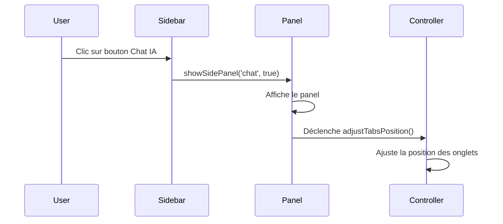
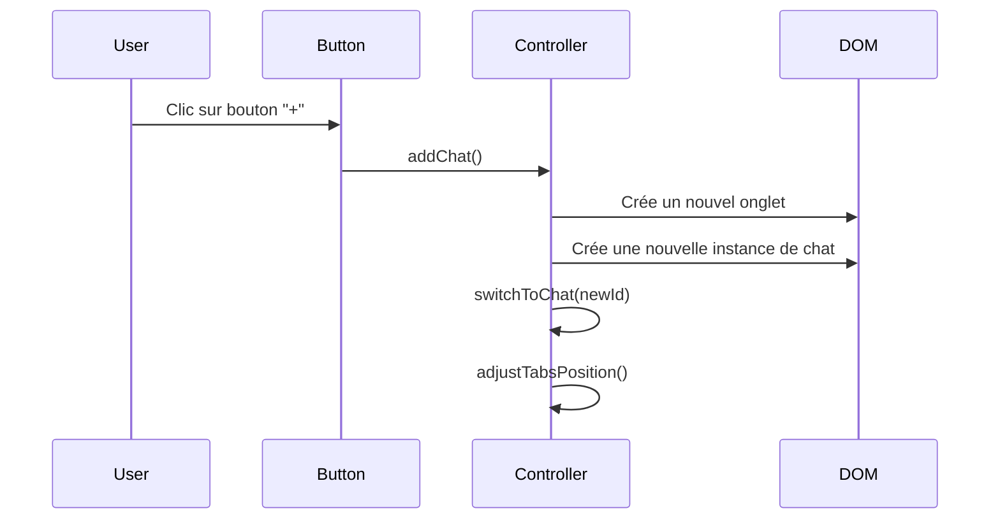
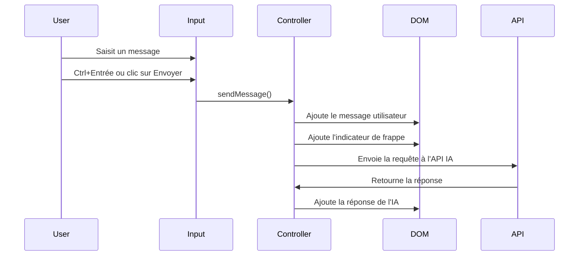
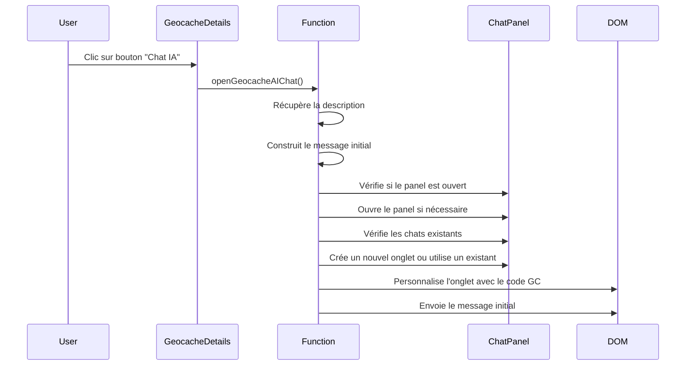

# Documentation du Panel IA

## Vue d'ensemble

Le Panel IA est un composant modulaire de l'application MysteryAI qui permet aux utilisateurs d'interagir avec différentes instances d'assistants IA via une interface de chat. Ce panel est conçu pour être flexible, permettant la création de plusieurs conversations indépendantes accessibles via un système d'onglets.

## Architecture

Le Panel IA est construit autour de trois composants principaux :
1. Un contrôleur Stimulus (`ChatController`) qui gère la logique
2. Des styles CSS dédiés pour l'interface utilisateur
3. Une intégration avec le système de panneaux latéraux de l'application

```
+------------------+
|    Chat Tabs     |
+------------------+
|                  |
|                  |
|   Chat Content   |
|                  |
|                  |
+------------------+
|  Input & Send    |
+------------------+
```

## Fonctionnalités

### 1. Gestion des onglets multiples

Le panel permet de créer plusieurs conversations indépendantes, chacune accessible via son propre onglet. Les utilisateurs peuvent :
- Créer de nouvelles conversations
- Basculer entre les conversations existantes
- Fermer les conversations individuellement

### 2. Interface de chat

Chaque instance de chat comprend :
- Un en-tête avec le titre et un bouton de fermeture
- Une zone d'affichage des messages
- Une zone de saisie avec un bouton d'envoi

### 3. Interactions utilisateur

- **Création d'un nouveau chat** : Cliquer sur le bouton "+" dans la barre d'onglets
- **Changement de chat** : Cliquer sur l'onglet correspondant
- **Fermeture d'un chat** : Cliquer sur le bouton "×" dans l'en-tête du chat
- **Envoi de message** : Saisir du texte et cliquer sur le bouton d'envoi ou utiliser Ctrl+Entrée

### 4. Intégration avec les géocaches

Le panel IA s'intègre désormais avec les détails des géocaches, permettant aux utilisateurs de :
- Ouvrir un chat IA directement depuis la page de détails d'une géocache
- Initialiser automatiquement le chat avec les informations de la géocache (code, nom, description)
- Poser des questions spécifiques à l'IA concernant l'analyse de la géocache

## Implémentation technique

### Contrôleur Stimulus

Le `ChatController` est responsable de la gestion des instances de chat et des interactions utilisateur.

**Fichier** : `static/js/controllers/chat_controller.js`

**Cibles Stimulus** :
- `container` : Conteneur principal du chat
- `tabs` : Conteneur des onglets
- `chatList` : Conteneur des instances de chat
- `addButton` : Bouton d'ajout de nouveau chat
- `activeChat` : Référence au chat actif

**Valeurs Stimulus** :
- `nextId` : ID pour le prochain chat à créer
- `activeId` : ID du chat actuellement actif

**Méthodes principales** :
- `connect()` : Initialisation du contrôleur
- `addChat()` : Création d'une nouvelle instance de chat
- `switchToChat()` : Changement de chat actif
- `closeChat()` : Fermeture d'un chat
- `sendMessage()` : Envoi d'un message
- `adjustTabsPosition()` : Ajustement de la position des onglets pour éviter le chevauchement

**Méthodes exposées pour l'accès externe** :
- `element.addChat` : Permet d'ajouter un chat depuis l'extérieur du contrôleur
- `element.switchToChat` : Permet de basculer vers un chat spécifique depuis l'extérieur

### Styles CSS

Les styles du panel sont définis dans un fichier CSS dédié.

**Fichier** : `static/css/chat_panel.css`

**Composants stylisés** :
- Conteneur principal
- Barre d'onglets
- Onglets individuels
- Bouton d'ajout
- Instances de chat
- Messages (utilisateur et système)
- Zone de saisie et bouton d'envoi

### Intégration avec le système de panneaux

Le panel IA est intégré au système de panneaux latéraux de l'application.

**Fichier** : `static/js/panels.js`

**Intégration** :
- Gestion spéciale dans la fonction `showSidePanel` pour le panel de chat
- Ajustement automatique des onglets lors de l'ouverture du panel

### Intégration avec les géocaches

L'intégration avec les géocaches est gérée par une fonction JavaScript dédiée.

**Fichier** : `templates/geocache_details.html`

**Fonction** : `openGeocacheAIChat(geocacheId, gcCode, geocacheName)`

**Fonctionnalités** :
- Récupération de la description de la géocache
- Construction d'un message initial pour l'IA
- Ouverture du panneau de chat si nécessaire
- Création d'un nouvel onglet ou utilisation d'un onglet existant
- Personnalisation de l'onglet avec le code GC
- Envoi automatique du message initial

## Structure HTML

### Panneau de chat principal

```html
<div id="chat-panel" class="chat-container" data-controller="chat">
    <div class="chat-tabs" data-chat-target="tabs">
        <!-- Les onglets de chat sont ajoutés ici dynamiquement -->
        <button class="chat-add-button" data-chat-target="addButton" data-action="click->chat#addChat">
            <i class="fas fa-plus"></i>
        </button>
    </div>
    <div class="chat-list" data-chat-target="chatList">
        <!-- Les instances de chat sont ajoutées ici dynamiquement -->
    </div>
    <input type="hidden" data-chat-target="activeChat">
</div>
```

### Bouton "Chat IA" dans les détails de géocache

```html
<button 
    id="ai-chat-geocache-button"
    class="bg-green-600 hover:bg-green-700 text-white px-4 py-2 rounded-lg text-sm flex items-center space-x-2 ml-2"
    onclick="openGeocacheAIChat('{{ geocache.id }}', '{{ geocache.gc_code }}', '{{ geocache.name|replace("'", "\\'") }}')"
    data-geocache-id="{{ geocache.id }}"
    data-gc-code="{{ geocache.gc_code }}"
    data-geocache-name="{{ geocache.name|replace("'", "\\'") }}">
    <svg xmlns="http://www.w3.org/2000/svg" class="h-4 w-4" fill="none" viewBox="0 0 24 24" stroke="currentColor">
        <path stroke-linecap="round" stroke-linejoin="round" stroke-width="2" d="M8 10h.01M12 10h.01M16 10h.01M9 16H5a2 2 0 01-2-2V6a2 2 0 012-2h14a2 2 0 012 2v8a2 2 0 01-2 2h-5l-5 5v-5z" />
    </svg>
    <span>Chat IA</span>
</button>
```

## Structure d'une instance de chat

Chaque instance de chat est créée dynamiquement avec la structure suivante :

```html
<div class="chat-instance" data-chat-id="1">
    <div class="chat-header">
        <h2 class="text-sm font-semibold mb-2">CHAT IA #1</h2>
        <button class="chat-close-button" data-action="click->chat#closeChat" data-chat-id="1">
            <i class="fas fa-times"></i>
        </button>
    </div>
    <div class="chat-messages">
        <!-- Les messages du chat apparaissent ici -->
        <div class="chat-message system">
            <div class="message-content">
                Bonjour, je suis votre assistant IA. Comment puis-je vous aider aujourd'hui?
            </div>
        </div>
    </div>
    <div class="chat-input-container">
        <textarea class="chat-input" rows="3" placeholder="Tapez votre message..." 
                  data-action="keydown->chat#handleKeydown"></textarea>
        <button class="chat-send-button" data-action="click->chat#sendMessage">
            <i class="fas fa-paper-plane"></i>
        </button>
    </div>
</div>
```

## Flux d'interaction

### 1. Ouverture du panel



### 2. Création d'un nouveau chat



### 3. Envoi d'un message



### 4. Ouverture d'un chat depuis une géocache



## Configuration du backend

### Routes API

Le backend expose une API pour interagir avec les modèles d'IA.

**Fichier** : `app/routes/ai_routes.py`

**Routes principales** :
- `/api/ai/chat` : Endpoint pour envoyer des messages et recevoir des réponses
- `/api/ai/settings_panel` : Endpoint pour charger le panneau de configuration de l'IA

### Configuration CORS

Pour permettre les requêtes depuis différentes origines, la configuration CORS est définie dans le fichier d'initialisation de l'application.

**Fichier** : `app/__init__.py`

```python
CORS(app, resources={
    r"/*": {
        "origins": ["http://localhost:8080", "http://localhost:3000", "http://127.0.0.1:3000", "http://127.0.0.1:8080"],
        "methods": ["GET", "POST", "PUT", "DELETE", "OPTIONS"],
        "allow_headers": ["Content-Type", "HX-Request", "HX-Current-URL", "HX-Target", "HX-Trigger"],
        "supports_credentials": True
    }
})
```

## Personnalisation

### Modification des styles

Les styles du panel peuvent être personnalisés en modifiant le fichier `static/css/chat_panel.css`. Les principaux éléments à personnaliser sont :

- Couleurs de fond et de texte
- Dimensions des éléments
- Espacement et marges
- Animations et transitions

### Extension des fonctionnalités

Pour étendre les fonctionnalités du panel IA, vous pouvez :

1. **Ajouter des types de messages** : Modifier la méthode `sendMessage()` pour prendre en charge différents types de contenu (images, liens, code, etc.)

2. **Intégrer d'autres modèles d'IA** : Ajouter la prise en charge de différents modèles d'IA (GPT-4, Claude, etc.)

3. **Ajouter des fonctionnalités avancées** : Historique des conversations, export de chat, suggestions de réponses, etc.

4. **Améliorer l'intégration avec les géocaches** : Ajouter des fonctionnalités spécifiques pour l'analyse des géocaches

## Bonnes pratiques

1. **Gestion de la mémoire** : Limiter le nombre de chats actifs pour éviter les problèmes de performance

2. **Accessibilité** : S'assurer que le panel est utilisable au clavier et compatible avec les lecteurs d'écran

3. **Responsive design** : Adapter l'interface pour différentes tailles d'écran

4. **Gestion des erreurs** : Implémenter une gestion robuste des erreurs pour les interactions avec l'API

5. **Sécurité** : Masquer les clés API et autres informations sensibles

## Dépannage

### Problèmes courants

1. **Chevauchement des onglets** : Si les onglets sont masqués par la barre latérale, vérifiez que la méthode `adjustTabsPosition()` est correctement appelée.

2. **Messages non affichés** : Assurez-vous que la structure HTML des messages est correcte et que les styles sont appliqués.

3. **Problèmes de focus** : Vérifiez que la méthode `switchToChat()` met correctement le focus sur la zone de texte.

4. **Erreurs CORS** : Si vous rencontrez des erreurs CORS, vérifiez que la configuration CORS dans `app/__init__.py` inclut toutes les origines nécessaires.

5. **Problèmes avec les caractères spéciaux** : Assurez-vous que les noms de géocaches contenant des caractères spéciaux sont correctement échappés avec `replace("'", "\\'")`.

### Débogage

Le contrôleur inclut des logs de débogage qui peuvent être consultés dans la console du navigateur :

```javascript
console.log('=== DEBUG: ChatController connecté ===');
```

## Évolutions futures

1. **Intégration avec d'autres fonctionnalités** : Connecter le panel IA avec d'autres composants de l'application (solver, analyseur, etc.)

2. **Amélioration de l'interface utilisateur** : Ajouter des fonctionnalités comme la saisie prédictive, les raccourcis clavier, etc.

3. **Personnalisation avancée** : Permettre aux utilisateurs de personnaliser l'apparence et le comportement du panel

4. **Analyse contextuelle** : Améliorer la capacité de l'IA à comprendre le contexte des géocaches et à fournir des analyses plus pertinentes

5. **Intégration avec les waypoints** : Permettre à l'IA d'analyser et de suggérer des waypoints basés sur la description de la géocache

## Références

- [Documentation Stimulus](https://stimulus.hotwired.dev/)
- [Documentation FontAwesome](https://fontawesome.com/icons) (pour les icônes)
- [Documentation du système de panneaux](layout_system.md) 