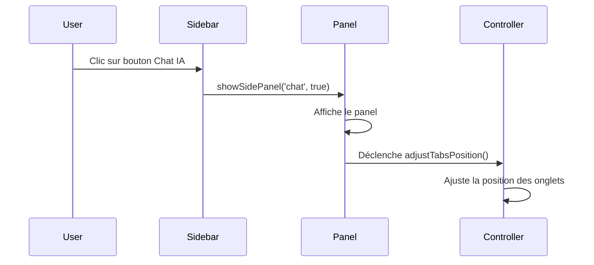
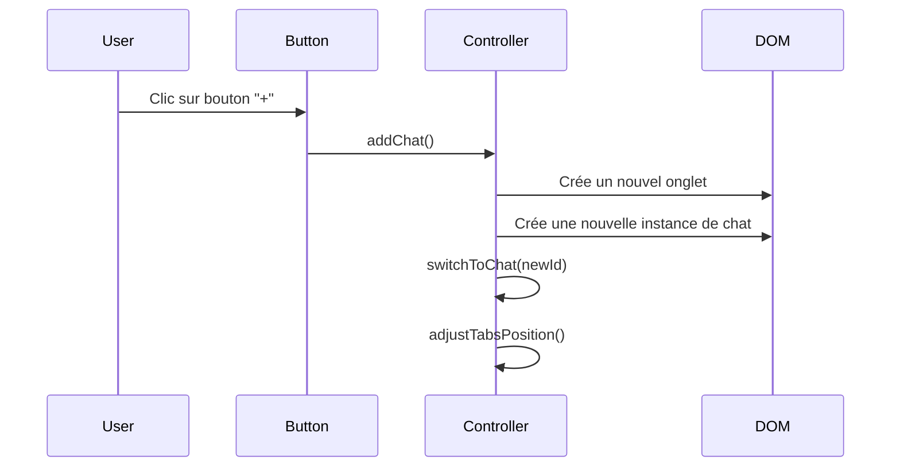
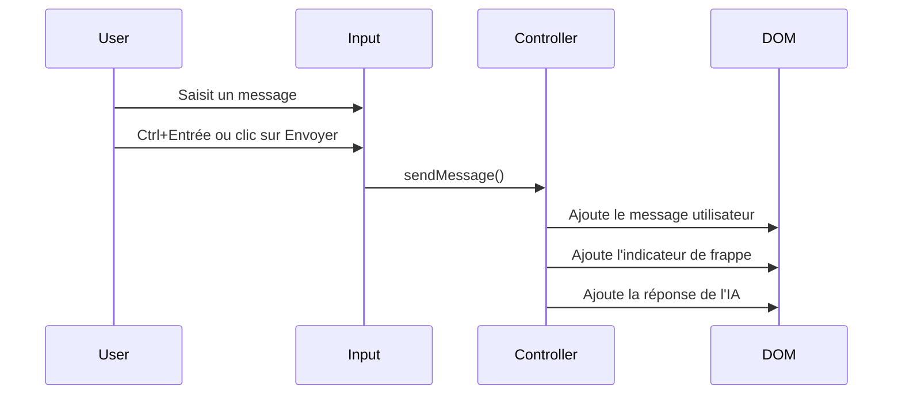

# Documentation du Panel IA

## Vue d'ensemble

Le Panel IA est un composant modulaire de l'application MysteryAI qui permet aux utilisateurs d'interagir avec différentes instances d'assistants IA via une interface de chat. Ce panel est conçu pour être flexible, permettant la création de plusieurs conversations indépendantes accessibles via un système d'onglets.

## Architecture

Le Panel IA est construit autour de trois composants principaux :
1. Un contrôleur Stimulus (`ChatController`) qui gère la logique
2. Des styles CSS dédiés pour l'interface utilisateur
3. Une intégration avec le système de panneaux latéraux de l'application

```
+------------------+
|    Chat Tabs     |
+------------------+
|                  |
|                  |
|   Chat Content   |
|                  |
|                  |
+------------------+
|  Input & Send    |
+------------------+
```

## Fonctionnalités

### 1. Gestion des onglets multiples

Le panel permet de créer plusieurs conversations indépendantes, chacune accessible via son propre onglet. Les utilisateurs peuvent :
- Créer de nouvelles conversations
- Basculer entre les conversations existantes
- Fermer les conversations individuellement

### 2. Interface de chat

Chaque instance de chat comprend :
- Un en-tête avec le titre et un bouton de fermeture
- Une zone d'affichage des messages
- Une zone de saisie avec un bouton d'envoi

### 3. Interactions utilisateur

- **Création d'un nouveau chat** : Cliquer sur le bouton "+" dans la barre d'onglets
- **Changement de chat** : Cliquer sur l'onglet correspondant
- **Fermeture d'un chat** : Cliquer sur le bouton "×" dans l'en-tête du chat
- **Envoi de message** : Saisir du texte et cliquer sur le bouton d'envoi ou utiliser Ctrl+Entrée

## Implémentation technique

### Contrôleur Stimulus

Le `ChatController` est responsable de la gestion des instances de chat et des interactions utilisateur.

**Fichier** : `static/js/controllers/chat_controller.js`

**Cibles Stimulus** :
- `tabs` : Conteneur des onglets
- `chatList` : Conteneur des instances de chat
- `addButton` : Bouton d'ajout de nouveau chat
- `activeChat` : Référence au chat actif

**Valeurs Stimulus** :
- `nextId` : ID pour le prochain chat à créer
- `activeId` : ID du chat actuellement actif

**Méthodes principales** :
- `connect()` : Initialisation du contrôleur
- `addChat()` : Création d'une nouvelle instance de chat
- `switchChat()` : Changement de chat actif
- `closeChat()` : Fermeture d'un chat
- `sendMessage()` : Envoi d'un message
- `adjustTabsPosition()` : Ajustement de la position des onglets pour éviter le chevauchement

### Styles CSS

Les styles du panel sont définis dans un fichier CSS dédié.

**Fichier** : `static/css/chat_panel.css`

**Composants stylisés** :
- Conteneur principal
- Barre d'onglets
- Onglets individuels
- Bouton d'ajout
- Instances de chat
- Messages (utilisateur et système)
- Zone de saisie et bouton d'envoi

### Intégration avec le système de panneaux

Le panel IA est intégré au système de panneaux latéraux de l'application.

**Fichier** : `static/js/panels.js`

**Intégration** :
- Gestion spéciale dans la fonction `showSidePanel` pour le panel de chat
- Ajustement automatique des onglets lors de l'ouverture du panel

## Structure HTML

```html
<div id="chat-panel" class="chat-container" data-controller="chat">
    <div class="chat-tabs" data-chat-target="tabs">
        <!-- Les onglets de chat sont ajoutés ici dynamiquement -->
        <button class="chat-add-button" data-chat-target="addButton" data-action="click->chat#addChat">
            <i class="fas fa-plus"></i>
        </button>
    </div>
    <div class="chat-list" data-chat-target="chatList">
        <!-- Les instances de chat sont ajoutées ici dynamiquement -->
    </div>
    <input type="hidden" data-chat-target="activeChat">
</div>
```

## Structure d'une instance de chat

Chaque instance de chat est créée dynamiquement avec la structure suivante :

```html
<div class="chat-instance" data-chat-id="1">
    <div class="chat-header">
        <h2 class="text-sm font-semibold mb-2">CHAT IA #1</h2>
        <button class="chat-close-button" data-action="click->chat#closeChat" data-chat-id="1">
            <i class="fas fa-times"></i>
        </button>
    </div>
    <div class="chat-messages">
        <!-- Les messages du chat apparaissent ici -->
        <div class="chat-message system">
            <div class="message-content">
                Bonjour, je suis votre assistant IA. Comment puis-je vous aider aujourd'hui?
            </div>
        </div>
    </div>
    <div class="chat-input-container">
        <textarea class="chat-input" rows="3" placeholder="Tapez votre message..." 
                  data-action="keydown->chat#handleKeydown"></textarea>
        <button class="chat-send-button" data-action="click->chat#sendMessage">
            <i class="fas fa-paper-plane"></i>
        </button>
    </div>
</div>
```

## Flux d'interaction

### 1. Ouverture du panel



### 2. Création d'un nouveau chat



### 3. Envoi d'un message



## Personnalisation

### Modification des styles

Les styles du panel peuvent être personnalisés en modifiant le fichier `static/css/chat_panel.css`. Les principaux éléments à personnaliser sont :

- Couleurs de fond et de texte
- Dimensions des éléments
- Espacement et marges
- Animations et transitions

### Extension des fonctionnalités

Pour étendre les fonctionnalités du panel IA, vous pouvez :

1. **Ajouter des types de messages** : Modifier la méthode `sendMessage()` pour prendre en charge différents types de contenu (images, liens, code, etc.)

2. **Intégrer une API IA réelle** : Remplacer la méthode `simulateAiResponse()` par une véritable connexion à une API d'IA

3. **Ajouter des fonctionnalités avancées** : Historique des conversations, export de chat, suggestions de réponses, etc.

## Bonnes pratiques

1. **Gestion de la mémoire** : Limiter le nombre de chats actifs pour éviter les problèmes de performance

2. **Accessibilité** : S'assurer que le panel est utilisable au clavier et compatible avec les lecteurs d'écran

3. **Responsive design** : Adapter l'interface pour différentes tailles d'écran

4. **Gestion des erreurs** : Implémenter une gestion robuste des erreurs pour les interactions avec l'API

## Dépannage

### Problèmes courants

1. **Chevauchement des onglets** : Si les onglets sont masqués par la barre latérale, vérifiez que la méthode `adjustTabsPosition()` est correctement appelée.

2. **Messages non affichés** : Assurez-vous que la structure HTML des messages est correcte et que les styles sont appliqués.

3. **Problèmes de focus** : Vérifiez que la méthode `switchToChat()` met correctement le focus sur la zone de texte.

### Débogage

Le contrôleur inclut des logs de débogage qui peuvent être consultés dans la console du navigateur :

```javascript
console.log('=== DEBUG: ChatController connecté ===');
```

## Évolutions futures

1. **Persistance des conversations** : Sauvegarder les conversations entre les sessions
2. **Personnalisation des assistants** : Permettre de configurer différents types d'assistants pour chaque onglet
3. **Intégration avec le système de géocaches** : Lier les conversations à des géocaches spécifiques
4. **Partage de conversations** : Permettre d'exporter et de partager des conversations
5. **Suggestions contextuelles** : Proposer des suggestions basées sur le contexte de l'application

## Références

- [Documentation Stimulus](https://stimulus.hotwired.dev/)
- [Documentation FontAwesome](https://fontawesome.com/icons) (pour les icônes)
- [Documentation du système de panneaux](layout_system.md) 